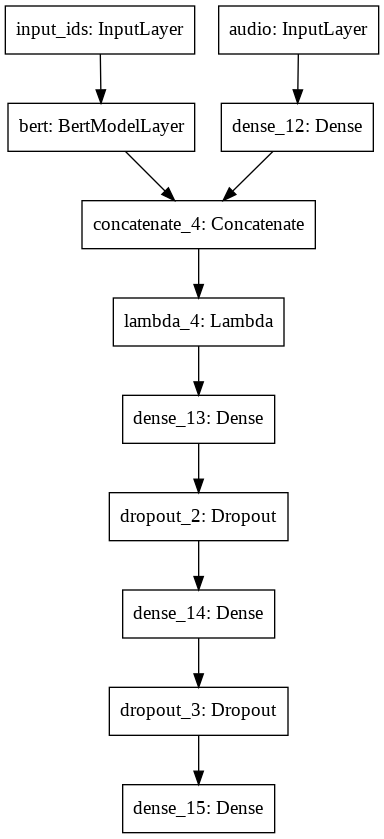
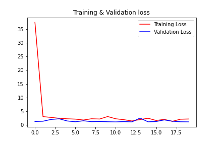

# Volatility-Prediction-using-MAEC-Dataset
Problem statement - Implement a solution to forecast stock 'volatility' following earnings calls release of S&P1500 companies. 
 
Plan of Action -  
Initially a block of code in order to extract all the .txt files and the .npy files for a given date and stock code needs to be made.  
Further we need to get the ground truth values of the closing price for stock on that perticular and nearby dates, for which Yahoo finance would be used.  
Also these closing price needs to be used to calculate the average log volatility of the stock using the appropriate formule.  
# Model
1) A Text encoder would be used in order to encode the text.txt files for each stock, probably using BERT would be helpful  
2) An audio encoder would be made in order to encode the .npy files  
3) Merging the 2 models and finally predicting the average log volatility of that stock for the next 3 days.  

# Other information
I have used Adam optimizer and Mean squared error as a loss  
Only 100 companies have been used in order to train the model as the dataset is too large and there are computational constraints.  

# Performance of the model
The model was trained for 20 epochs and the loss reduced from 50.27 to a minimum of 0.75 (MAE)  

# Scope for future work
The model used for audio encoder could be better made by plotting the spectrogram of the audio file and then using CNN model to get the intricate details of the speech. 

# Refrences
1) VolTAGE: Volatility Forecasting via Text Audio Fusion with Graph Convolution Networks for Earnings Calls - Ramit Sawhney et al  
2) Dataset - https://github.com/Earnings-Call-Dataset/MAEC-A-Multimodal-Aligned-Earnings-Conference-Call-Dataset-for-Financial-Risk-Prediction
